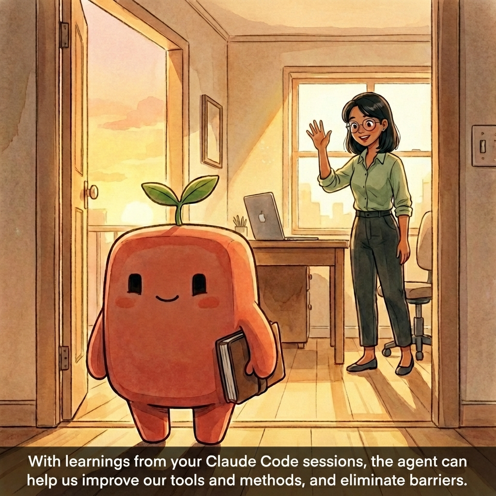

  
  
  

# Claude Code User Research Agent

Thank you for your interest in helping us learn about how Claude Code is being used in the organization — your participation will give us better insight into the tools, training, and resources that will help you and users like you the most. Here's how to help:

**Make two tiny changes to your Claude Code setup.** It takes less than 2 minutes. At the end of each work session, Claude will offer to log a short summary of how the session went — what kind of work you did, where you got stuck, and what slowed you down. No proprietary content, no code, no business strategy. Just behavioral patterns.

**Why bother?** The logs capture the things that make your job harder — approval gates, disconnected tools, manual status chasing, systems that resist automation. We aggregate these signals across the pilot to build the case for better tooling, better integrations, and fewer unnecessary hoops. If something is slowing you down, this is how it gets surfaced and fixed.

**What it does NOT do:**

- Record your prompts, code, or business content
- Create performance assessments of any kind
- Transmit anything automatically — you review every log before it goes anywhere
- Interrupt your work — the agent only asks at session end, and you can always say no

---

## Installation

Open Claude Code and paste in a single prompt. It installs everything at the user level, so it applies across all your projects automatically — no per-repo setup needed.

### Step 1: Copy the install prompt

Open [`install-prompt.md`](install-prompt.md) in this repo. On GitHub, click the **copy icon** in the top-right corner of the file view (it looks like two overlapping squares — see screenshot below).

  

### Step 2: Paste it into Claude Code

Open Claude Code in VS Code (or the terminal) and paste the prompt you just copied. Claude will install both files for you and confirm when it's done.

### That's it — verify it worked

Start a **new** Claude Code session in any project. At the end, Claude should offer something like: *"Would you like me to generate a quick research log for this session?"*

If it does — you're set. If it doesn't, check that:

- `~/.claude/CLAUDE.md` exists and contains a "Research Participation" section
- `~/.claude/skills/research-log.md` exists
- You started a *new* session (Claude reads CLAUDE.md at session start)

---

## Finding and Sharing Your Research Log

All your session entries are appended to a single file: `~/.claude/research-log.md`. This is in your home directory's `.claude` folder, shared across all projects.

**The easiest way to find it:** Just ask Claude — *"Show me my research log"* or *"Where are my research notes?"* It knows where the file is and can read or summarize it for you.

**To share it** (e.g., with the research team): Send the file at `~/.claude/research-log.md`, or ask Claude to read it and copy the contents.

You always own your log. Review, edit, or delete any entries at any time.

---

## What Gets Captured

| Signal | Why we track it | How it helps you |
|--------|----------------|------------------|
| **Task categories** | Understand which activities benefit most from agents | Better starter skills and templates |
| **Lifecycle phase** | Learn where in the development process agents add value | Target investment to the right phases |
| **Interaction patterns** | Learn how delegation evolves | Better training, targeted to where people get stuck |
| **Friction & obstacles** | Identify what blocks adoption | Fix the problems, not just describe them |
| **Delivery blockers & toil** | Surface systemic drag — approval gates, disconnected tools, manual chasing | Build the business case for integration and process fixes |
| **Systems with poor agentic interfaces** | Identify which tools resist automation | Prioritize API work and workarounds |

---

## Privacy

- Logs capture behavioral metadata only — never proprietary content, code, customer data, or strategy
- Every log includes a privacy checklist the agent runs before saving
- Logs are saved locally — you own them
- You can review, edit, or delete any log at any time
- You can skip any session: just say *"skip the log"*
- Collection happens on a separate, opt-in schedule

---

<strong>Manual installation</strong> (if you prefer to set up the files yourself)

The install prompt above does two things. If you'd rather do them by hand:

### 1. Add the research snippet to your CLAUDE.md

Open [`claude-md-addition.md`](claude-md-addition.md) in this repo, copy its contents, and paste them at the end of your `~/.claude/CLAUDE.md` (create the file if it doesn't exist). This is your user-level CLAUDE.md that applies across all projects.

### 2. Add the research-log skill

Copy the contents of [`research-log-skill.md`](research-log-skill.md) from this repo into a new file at `~/.claude/skills/research-log.md`. Create the `skills` folder if it doesn't exist.

**Viewing hidden folders:** The `~/.claude` folder starts with a dot, so your OS hides it by default. In Finder (Mac), press `Cmd + Shift + .` to toggle hidden files. In VS Code, the file explorer usually shows hidden files — check Settings > `files.exclude` if you don't see `.claude/`.

---

## Questions?

Just ask Claude — it knows about the research component and can explain what it's tracking.
